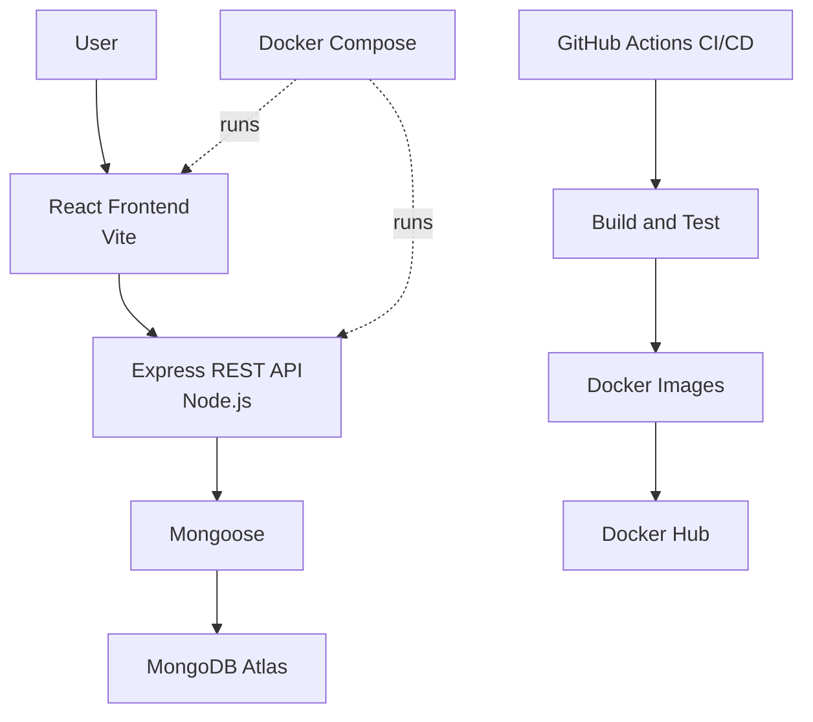

# TaskFlow - DevOps Task Management Application

## Project Overview
TaskFlow is a full-stack task management application built to demonstrate both software engineering and DevOps practices. It combines a React frontend, an Express REST API backend, MongoDB Atlas persistence through Mongoose, containerized workflows with Docker, and CI/CD automation with GitHub Actions.

## Architecture
Application flow:

User  
-> React Frontend (Vite)  
-> Express REST API (Node.js)  
-> Mongoose  
-> MongoDB Atlas

Supporting DevOps components:
- Docker and Docker Compose package and run frontend and backend services.
- GitHub Actions builds, tests, and publishes Docker images.



## Features
- Create tasks
- View tasks
- Update tasks
- Delete tasks
- Mark tasks as completed
- Task priorities

## Project Structure
```text
todoapp/
|-- frontend/
|-- backend/
|-- .github/
|   `-- workflows/
|-- docker-compose.yml
`-- README.md
```

## Local Setup
### 1) Clone the repository
```bash
git clone https://github.com/<your-username>/<your-repo>.git
cd todoapp
```

### 2) Install frontend dependencies
```bash
cd frontend
npm ci
```

### 3) Install backend dependencies
```bash
cd ../backend
npm ci
```

### 4) Configure backend environment variables
Create backend/.env with:

```dotenv
MONGODB_URI=
PORT=5000
```

Use your own MongoDB Atlas connection string for MONGODB_URI.

### 5) Start backend
```bash
cd backend
npm start
```

### 6) Start frontend
Open a new terminal:

```bash
cd frontend
npm run dev
```

## API Endpoints
- GET /api/tasks
- POST /api/tasks
- PUT /api/tasks/:id
- DELETE /api/tasks/:id

## Docker
Build and run the application with Docker Compose:

```bash
docker compose up --build
```

This starts:
- Frontend on port 5173
- Backend on port 5000

## CI/CD Pipeline
GitHub Actions workflow in .github/workflows/ci.yml performs:
- Checkout repository
- Set up Node.js
- Install frontend dependencies
- Build frontend
- Install backend dependencies
- Run backend tests
- Build Docker images
- Log in to Docker Hub
- Push Docker images

## Environment Variables
Backend environment variables:

```dotenv
MONGODB_URI=
PORT=5000
```

Important:
- Do not commit .env files to Git.
- Store sensitive values in GitHub Secrets for CI/CD.
- GitHub Actions reads MONGODB_URI from repository secrets.

## Testing
Run backend automated tests:

```bash
cd backend
npm test
```

Current backend automated tests cover:
- GET /api/tasks
- POST /api/tasks

## DevOps Practices Demonstrated
- Git workflow and GitHub-based collaboration
- REST API development with Node.js and Express
- MongoDB Atlas integration with Mongoose
- Docker containerization with Docker Compose
- Automated backend API testing
- GitHub Actions CI/CD automation
- Docker Hub image publishing
- Environment variable and secrets management
